# おやつ

おやつの時間を把握する為のウィジェット. 

おやつの時間がそもそもなんなのか? 午後とは? 丑三つ時とは?  
昔の時刻の呼び方で「八つ時（やつどき）」（つまり現代の午後3時ころ）に食べたことからこう呼ばれた。現代では「3時のおやつ」などと呼ぶこともある。  
江戸時代には夜明は明六つ,つまり八つ:おやつの時間は明六つから2つ目がお八つ.昼八つは未の刻. それがおやつの時.午後はそのまま午(うま)の刻が過ぎて子(ね)の刻まで.  
夜明は卯一つ.

## 機能

* 和暦
* 和風月名
* グレゴリー日付
* 和時計時刻(不定時法)
* 二十四節気
* 干支

和時計時刻は位置情報:経度緯度から計算して表示します.  
位置情報を設定しない場合(インストールしたまま)は東京駅(`35.6895, 139.6917`)を使います.  

## スクリーンショット

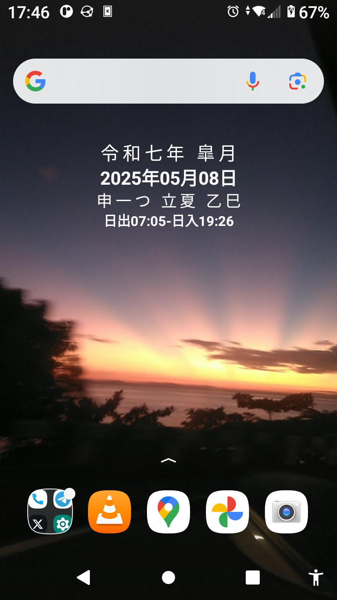  

- ランチャーでの表示  
 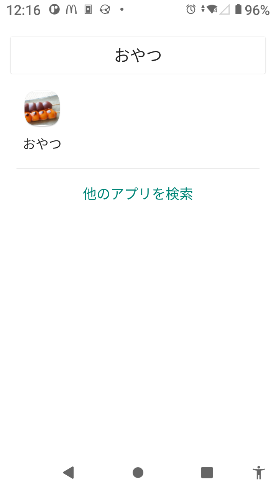  

 - ウィジェットでの表示  
 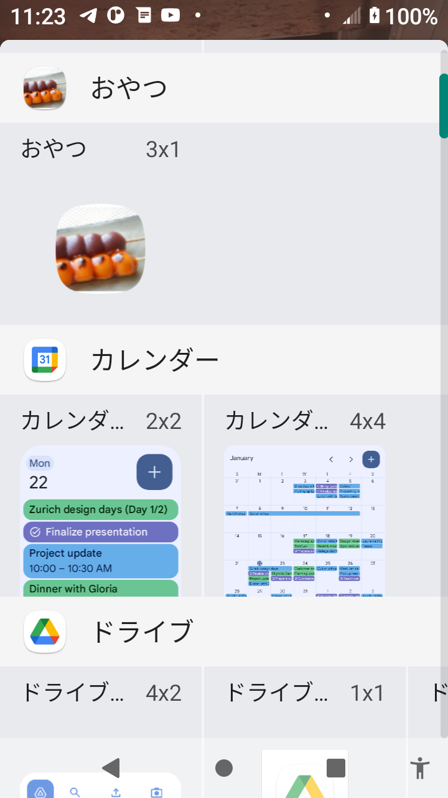  

  - アプリケーションでの表示  
 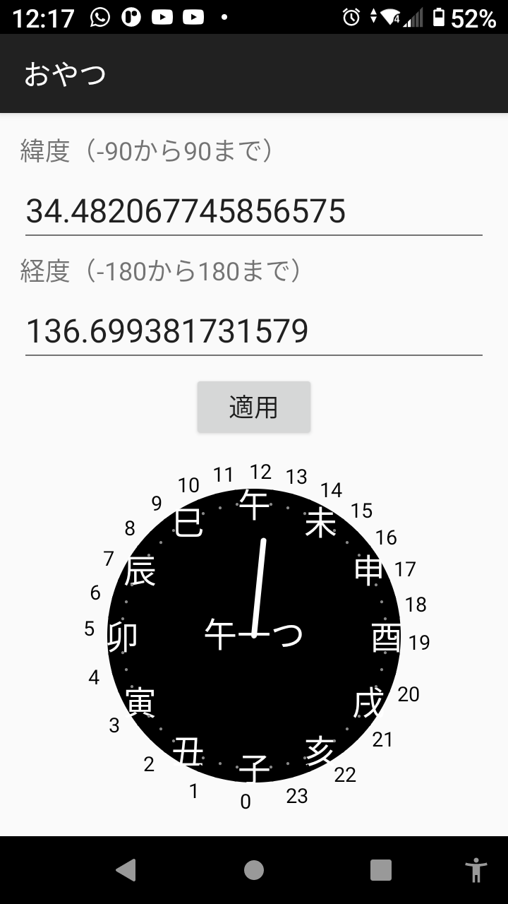  

## 使い方

- このサイトの [release page](https://github.com/tknv/oyatsu/releases) から最新版をダウンロードしてインストール

### 流れ  
- インストール
- 位置情報を入れて適用
- ウィジットをホームに配置

## 設定

### 位置情報を入れる

#### グーグルマップなどから緯度経度の数値をコピペする  

#### OsmAnd(オープンストリートマップアプリケーションを使う  

OsmAndとは、" **オフラインとオンラインのOSMマップのグローバルモバイルマップ表示とナビゲーション** " インターネットのないところでも使えます。様々な目的にあった地図が選べます、ハイキング用、スキー用、航海用など。

[OsmAnd - Google Play Store](https://play.google.com/store/apps/details?id=net.osmand&pcampaignid=web_share) もしくは [OsmAnd - F-droid](https://f-droid.org/ja/packages/net.osmand.plus/) からダウンロードしてインストールした後に共有からgeo:緯度、経度をおやつに設定する。  

地図で時刻をしりたい場所を選択する。和時計の時刻はその場所の日出、日入から計算されます。
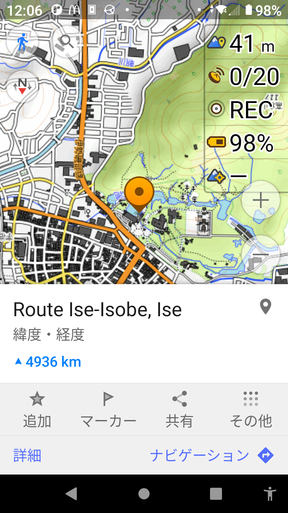  
共有をお押すとどの方法で共有するかの項目が表示されます。  
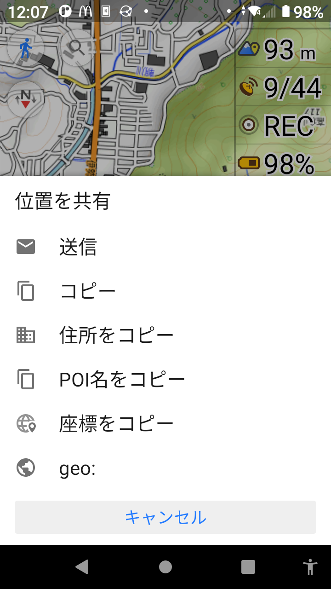  
geo: を選択するとどのアプリに共有するか表示されます。  
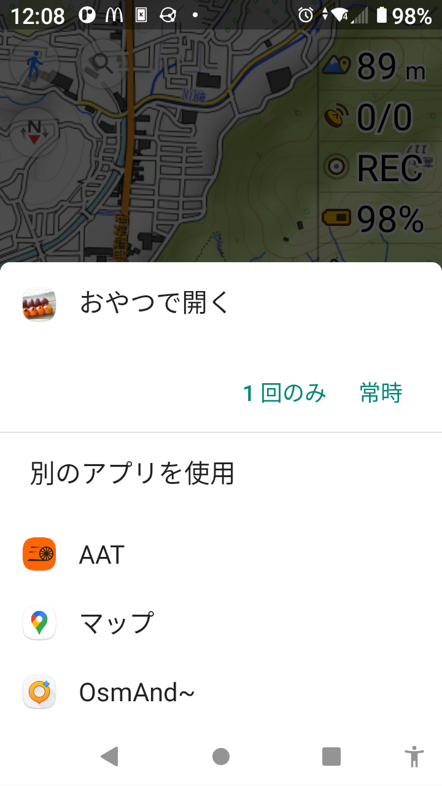  
"１回のみ" を選択するとおやつの位置情報入力画面に選択した地点の緯度経度が入力されています。  
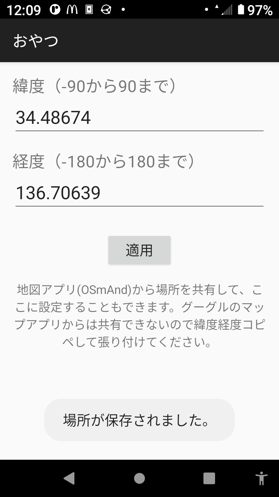  
適用を押します。  

#### AATを使う  

AATとは、"GPS-tracking application for sportive activities, with emphasis on cycling."、自転車、ハイキング、マラソンなど、スポーツで場所と速度、高低差などの情報もとれます。マップも様々なものから選択可能。 

[AAT - F-droid](https://f-droid.org/packages/ch.bailu.aat/) からダウンロードしてインストールした後に共有からgeo:緯度、経度をおやつに設定する。  
[AAT - Github](https://github.com/bailuk/AAT/tree/master) ここに情報があります。  

起動して、MAPに行き、地図で時刻を知りたい場所を画面中央にする(画面の下部をタップし、四角の1を押すと現在の場所になります)、そして **画面左側をタップする** とかメニューが出ます、マーカーアイコンを押す。  
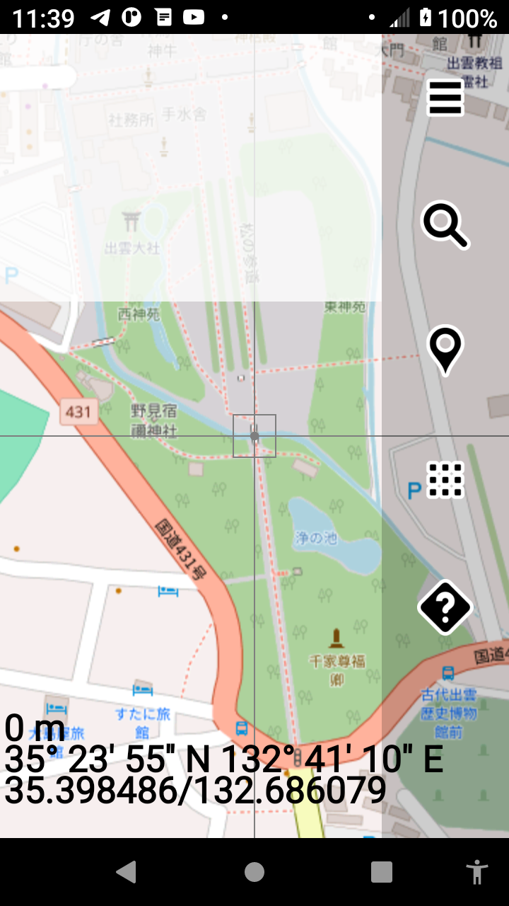  
このマーカー項目にある View location... を選びます。  
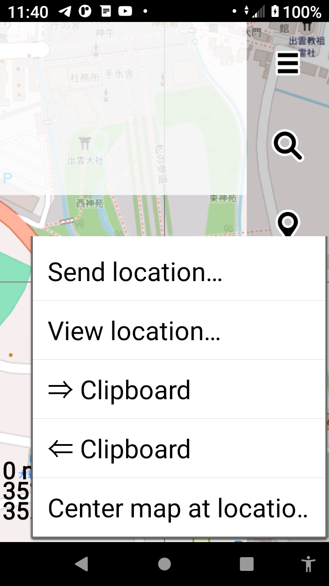   
選択した地点の緯度経度がgeo:緯度 経度で表示され、おやつがあるので選択します。  
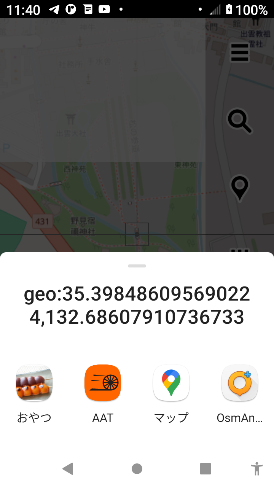  
ここで適用するとその地点での和時計時刻を表示します。   
    

### ウィジットをホーム画面に置く  

ホーム画面を長押しするとポップアップがでます。そこでウィジットを押すとウィジット選択画面がでるのでおやつをドラッグ アンド ドロップでホーム画面に配置してください。  
   

## アプリの入手先  

おやつはアンドロイドのウィジェット アプリです。 無料、広告なし。 
- F-Droidからダウンロード [F-Droid](https://f-droid.org/packages/lab.rredd.oyatsu/).  

  
      
- ここサイトの [release page](https://github.com/tknv/oyatsu/releases) から最新版をダウンロードしてインストール  

## ライセンス

[GNU GPLv3 or later](http://www.gnu.org/licenses/gpl.html)

### おやつ

© [Wikipedia, CC BY-SA 4.0](https://ja.wikipedia.org/wiki/%E3%81%8A%E3%82%84%E3%81%A4)  

### 不定時法

© [国立天文台](https://eco.mtk.nao.ac.jp/koyomi/wiki/BBFEB9EF2FC4EABBFECBA1A4C8C9D4C4EABBFECBA1.html)   

### 和風月名

出典：国立国会図書館「日本の暦」 [https://www.ndl.go.jp/koyomi/](https://www.ndl.go.jp/koyomi/)  

### だんご

出典:農林水産省ウェブサイト [農林水産省 うちの郷土料理 串だんご 東京都](https://www.maff.go.jp/j/keikaku/syokubunka/k_ryouri/search_menu/menu/34_29_tokyo.html#:~:text=%E5%9B%A3%E5%AD%90%E3%81%AF%E5%B9%B3%E5%AE%89%E6%99%82%E4%BB%A3%E3%81%AB,%E5%A3%B2%E3%82%8B%E5%BA%97%E3%82%82%E3%81%A7%E3%81%8D%E3%81%9F%E3%80%82)

> 「花より団子」という言葉がはやるほど人気が出て、全国的に広まった一串5つ刺しの串だんごは、京都発祥と言われる。
東京でも、江戸時代では5つ刺しが主流であり、1本5文銭で販売されていた。4文銭が流通を始めてから、買い求める客で混雑する中、**4文銭を置いて持ち帰る不正を行う客が増え、店主が困り苦肉の策でだんごの数を減らして4つ一串にしたことが、4つ刺しのだんごが生まれたはじまり** という記録が残っている。現在でも串だんごは **関東では4つ刺し、関西では5つ刺し** が主流である。

Copyright (C) [2025]  
This work incorporates AI-assisted.  
本作品はAI支援を含みます。  

このプログラムはフリーソフトウェアです。あなたはこれを、フリーソフトウェア財団によって発行されたGNU一般公衆利用許諾書（バージョン3か、それ以降のバージョンのうちどれか）が定める条件の下で再頒布または改変することができます。
このプログラムは有用であることを願って頒布されますが、全くの無保証です。商業可能性の保証や特定目的への適合性は、言外に示されたものも含め、全く存在しません。詳しくはGNU一般公衆利用許諾書をご覧ください。
あなたはこのプログラムと共に、GNU一般公衆利用許諾書のコピーを一部受け取っているはずです。もし受け取っていなければ、https://www.gnu.org/licenses/ をご覧ください。